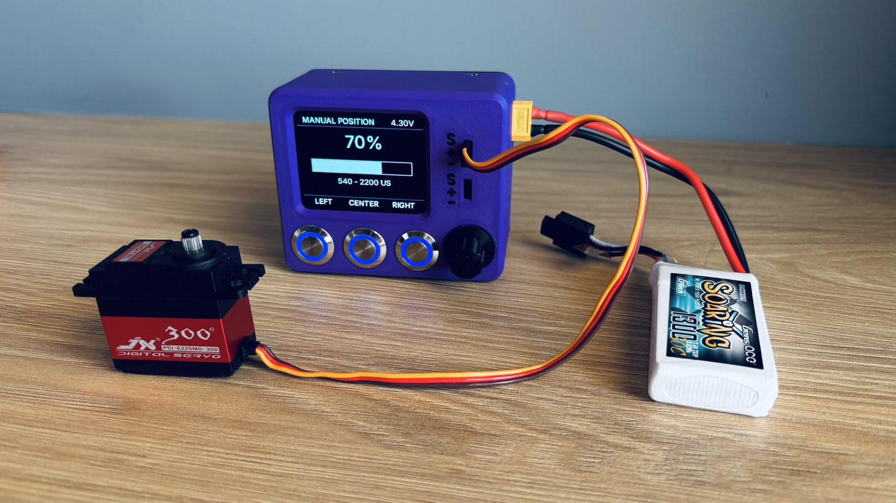

<div align="center">

# Ultimate Servo Tester V3 🛠️🚀
by **Agtheo09**

[](https://opensource.org/)
[](https://opensource.org/licenses/MIT)
[]()
[]()

</div>



<div align="center">

<a href="https://cad.onshape.com/documents/18e5575c1bfbf00e07aefd84/w/2994546400e9325c3d562d8c/e/b3a9ed863121c41737853b93?renderMode=0&uiState=6a5e2e75b6293da7eb19776a" target="_blank">
  
</a>

</div>

The **Ultimate Servo Tester V3** is a high-performance, open-source diagnostic instrument designed for makers, engineers, and robotics competitors.

Driven by an **Arduino Nano**, this project represents a complete hardware redesign focused on:

- Field durability
- Universal power compatibility
- Fast graphical visualization
- Safe servo testing
- Modular repairable construction

Unlike standard commercial servo testers that only verify position, the V3 introduces advanced **Velocity Profiling** and a **Mechanical Boundary Capture Routine** to safely characterize servo behavior without risking damage to mechanical systems.

---

# 📸 System Overview

| Parameter          | Specification                              |
| :----------------- | :----------------------------------------- |
| **Processor Core** | Arduino Nano (ATmega328P @ 16MHz)          |
| **Display Panel**  | 2.4" 240×320 SPI Graphical LCD             |
| **Bus Protocol**   | Hardware SPI (Fast refresh rate)           |
| **Control Input**  | Rotary encoder + dedicated buttons         |
| **Form Factor**    | Ultra-Compact layout (<80mm PCB footprint) |
| **BOM Cost**       | Under €40 using standard components        |
| **Assembly Time**  | Under 3 hours from bare PCB                |

---

# 🔥 Key Engineering Features

## 1. Multi-Mode Advanced Control

### Absolute Position Mode

Direct servo positioning using a precision rotary encoder interface.

### Velocity Sweep Mode

Automated servo movement cycles with adjustable speed profiling to analyze:

- Transition smoothness
- Stall points
- Mechanical resistance
- Servo response characteristics

### Mechanical Boundary Capture (Keyframing)

The tester allows users to manually define safe mechanical limits.

This prevents accidental over-driving of servos installed inside:

- Robotic joints
- RC mechanisms
- Custom linkages
- Limited travel assemblies

---

# 2. Dual-Stage Hardware Protection Circuit

Most hobby servo testers expose the controller directly to servo faults.

The V3 architecture separates the logic and servo power domains using a protection-focused power design.

```
                     [Power Input]
                           |
              +------------+------------+
              |                         |
       [2A Glass Fuse]          [PTC Polyfuse]
              |                         |
      [LM2596S Buck]          [Servo Output Rails]
              |
      [Arduino Logic Core]
```

Protection layers:

### Primary Input Protection

**2A Fast-Blow Glass Fuse**

Provides immediate isolation during major electrical faults.

### Servo Bus Protection

**2A PTC Resettable Fuse**

Automatically limits current during:

- Servo stalls
- Wiring shorts
- Excessive mechanical loads

The logic controller remains protected and powered.

---

# 3. Universal Multi-Chemistry Power Management

The onboard power system supports common robotics battery configurations.

Supported inputs:

- **2S - 3S LiPo**
  - 7.4V - 11.1V

- **6S - 10S NiMH**
  - 7.2V - 12V

- **8V - 12V DC Supply**
  - Via screw terminals

---

# 📈 Architectural Evolution

The V3 design is the result of multiple hardware iterations focused on improving usability, protection, and performance.

| Attribute     | V1                   | V2                           | V3                                         |
| :------------ | :------------------- | :--------------------------- | :----------------------------------------- |
| Interface     | 16x2 Character LCD   | 16x2 Character LCD           | **2.4" SPI Graphical LCD**                 |
| Control       | Raw position control | Position + center + velocity | **Position + velocity + boundary capture** |
| Communication | Parallel interface   | I2C                          | **Hardware SPI**                           |
| Protection    | None                 | Basic filtering              | **Glass Fuse + Servo PTC Protection**      |
| Power         | Barrel jack only     | Limited supply options       | **LiPo / NiMH / Bench Supply Compatible**  |

---

# 🗂️ Repository Organization

```
.
├── software/
│   ├── main/                 # Main Arduino firmware
│   ├── tests/                # Hardware validation sketches
│   └── font-optimization/    # Display font generation tools
│
├── hardware/
│   ├── pcb/                  # PCB fabrication files and 3D models
│   ├── stl_files/            # 3D printable enclosure components
│   └── SCHEMATIC_UltimateServoTester.pdf
│
├── md_pictures/              # Documentation images
│
└── README.md
```

---

# 🧩 Hardware Bill of Materials (BOM)

The V3 hardware philosophy is based on:

- Standard off-the-shelf components
- Easy hand assembly
- Repairability
- No proprietary modules

---

# 🏗️ Mechanical Components

| Qty  | Component                                   | Purpose                                                   |
| :--- | :------------------------------------------ | :-------------------------------------------------------- |
| 1x   | [3D Printed Components](hardware/stl_files) | Custom enclosure parts, covers, and mechanical interfaces |

Included models:

- Case for 12mm buttons
- Case for 16mm buttons
- Encoder knob
- LCD cover
- Nut covers
- Thread insert covers

---

# 🔌 PCB & Power Components

The V3 power system follows the dual-stage protection philosophy.

| Qty  | Component                     | Purpose                                |
| :--- | :---------------------------- | :------------------------------------- |
| 1x   | [Custom PCB](hardware/pcb)    | Main controller and power distribution |
| 1x   | XT60 Round PCB Connector      | Battery input                          |
| 2x   | 5mm Pitch Dual Screw Terminal | External power connections             |
| 1x   | 5×20mm Glass Fuse PCB Mount   | Primary fuse holder                    |
| 1x   | 2A Fast-Blow Glass Fuse       | Main power protection                  |
| 1x   | 2A PTC Resettable Fuse        | Servo bus protection                   |
| 1x   | LM2596S Buck Converter        | Logic power regulation                 |

---

# 🧠 Controller & User Interface

| Qty  | Component                                                                    | Purpose                  |
| :--- | :--------------------------------------------------------------------------- | :----------------------- |
| 1x   | Arduino Nano                                                                 | Main processing unit     |
| 1x   | [2.4" SPI LCD](https://grobotronics.com/display-2.4-240x320-lcd-module.html) | Graphical user interface |
| 1x   | Rotary Encoder                                                               | Menu navigation          |
| 3x   | Metal Push Buttons                                                           | User controls            |
| 1x   | 5V Passive Buzzer                                                            | Feedback indicator       |

---

# 🔩 Passive Components

| Qty  | Component         | Specification |
| :--- | :---------------- | :------------ |
| 1x   | Resistor          | 10kΩ 1/4W     |
| 1x   | Resistor          | 4.7kΩ 1/4W    |
| 1x   | Resistor          | 47Ω 1/4W      |
| 1x   | Ceramic Capacitor | 100nF         |
| 1x   | Ceramic Capacitor | 100µF         |
| 1x   | Ceramic Capacitor | 470µF         |

---

# 🔗 Connectors

| Qty  | Component             | Specification       |
| :--- | :-------------------- | :------------------ |
| ~8x  | Male Headers          | 2.54mm pitch        |
| 5x   | JST HX Connector Sets | 4-pin male + female |
| 1x   | JST HX Connector Set  | 5-pin male + female |

---

# 💰 Estimated Build Cost

| Category         | Estimated Cost          |
| :--------------- | :---------------------- |
| PCB              | Depends on manufacturer |
| Components       | ~€30-35                 |
| 3D Printed Parts | Depends on material     |
| Complete Device  | **< €40 target**        |

---

# 🚀 Quick Start Guide

## 1. Manufacture PCB

Use the fabrication files located in:

```
hardware/pcb/
```

The folder contains:

- Gerber package
- PCB previews
- Mechanical STEP files

---

## 2. Assemble Components

Populate the PCB by following the component footprints and silkscreen markings on the board.

Component placement is designed to be straightforward with clear PCB references for:

- Through-hole components
- Connectors
- Protection devices
- User interface hardware

The schematic is provided for electrical reference and troubleshooting:

```
hardware/SCHEMATIC_UltimateServoTester.pdf
```

Assembly should primarily follow the PCB footprint layout and silkscreen labels.

---

## 3. Upload Firmware

Open:

```
software/main/main.ino
```

Required:

- Arduino IDE
- Arduino Nano board definition
- Required display libraries

---

# 🤝 Open Source & Contributions

This project is fully open source.

Anyone can:

- Build the tester
- Modify the hardware
- Improve firmware
- Create new enclosure designs
- Submit improvements

Hardware optimization forks and pull requests are welcome.

---

# 📄 License

This project is licensed under the MIT License.

See:

```
LICENSE
```